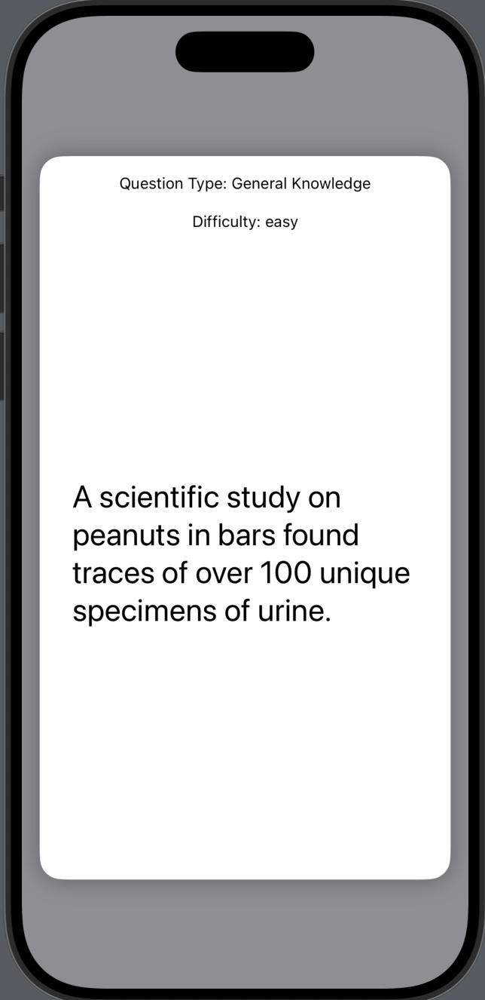
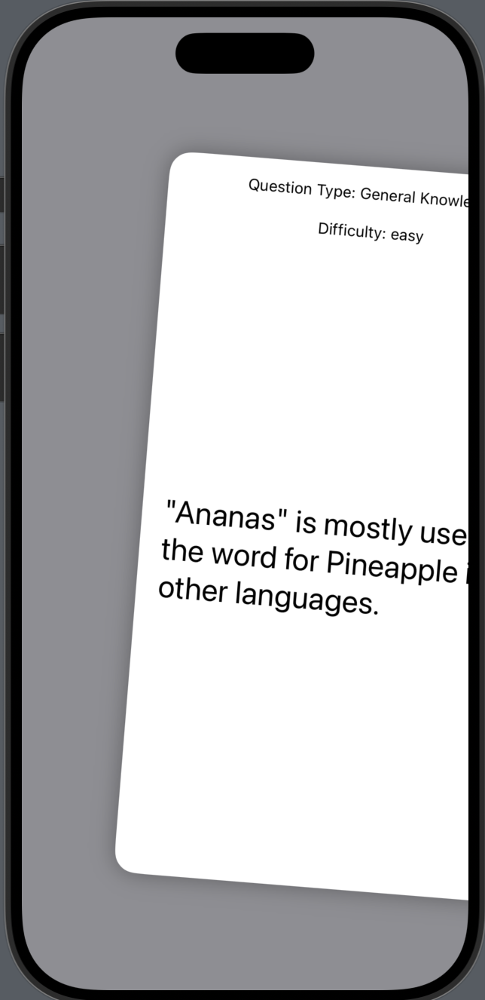
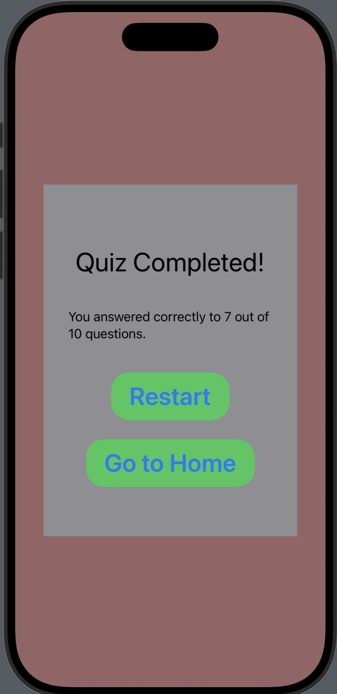

# Flashcards of Knowledge

Flashcards of Knowledge is a simple SwiftUI app that quizzes users with 10 true/false questions fetched from the Open Trivia Database. Users answer each question by swiping left (No/False) or right (Yes/True). At the end of the quiz, the app displays the total number of correct answers.

## Features

- Fetches 10 random true/false questions from an online API.
- Swipe right for "True", swipe left for "False".
- Animated card interface for answering questions.
- Displays category and difficulty for each question.
- Shows a summary of correct answers at the end.
- Option to restart the quiz or return to the home screen.

## What You Can Learn From This Project

- **Fetching Data from an API:**  
  Learn how to use `URLSession` and `async/await` to fetch and decode JSON data from a remote API ([`FetchQuestions`](Flashcards%20of%20Knowledge/ViewModel/FetchQuestion.swift)).

- **Building Swipeable Card Interfaces:**  
  See how to use SwiftUI gestures and animations to create interactive, swipeable cards for answering questions ([`CardItem`](Flashcards%20of%20Knowledge/Components/CardItem.swift)).

- **State Management in SwiftUI:**  
  Understand how to use `@State`, `@StateObject`, and `@Binding` to manage app state and data flow between views ([`ContentView`](Flashcards%20of%20Knowledge/ContentView.swift)).

- **Reusable Components:**  
  Create reusable SwiftUI components such as custom buttons ([`GenericButton`](Flashcards%20of%20Knowledge/Components/GenericButton.swift)).

- **Decoding JSON with Codable:**  
  Learn how to define data models that conform to `Codable` for easy JSON parsing ([`Question`](Flashcards%20of%20Knowledge/Model/Question.swift)).

## Project Structure

- `ContentView.swift` — Main app logic and state management.
- `Components/` — Reusable UI components (cards, buttons).
- `Model/` — Data models for questions.
- `ViewModel/` — Handles fetching and storing questions from the API.

## Screenshots

  
  
  

## Credits

- [Open Trivia Database](https://opentdb.com/) for the quiz questions API.

---
